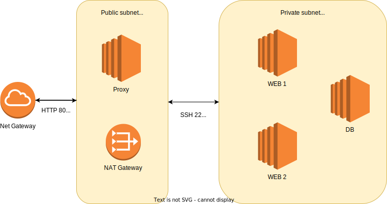

# WordPress_demo
Terraform + Ansible deployment for WordPress server on AWS EC2 instances

## Deployment steps
1) Create AWS user with programmatic access and store its credentionals in `~/.aws/credentials`. User should have follow aws permisions:    
```
AmazonEC2FullAccess
AmazonVPCFullAccess
AmazonElasticFileSystemFullAccess
```
2) Generate ssh key pair. Default key file is`~/.ssh/aws_word_press` defined as *ssh_key_file* variable in the terraform/main.tf file     
`ssh-keygen -b 4096 -t rsa -f ~/.ssh/aws_word_press`
3) Create database password via ansible-vault. Execute next command from project root dirrectory.   
`ansible-vault encrypt_string --ask-vault-password --stdin-name mysql_password > ansible/roles/common/vars/main/sql_pass.yml`
4) Apply terraform deployment
   1) Open terraform dir
   2) Init terraform environment  
   `terraform init`
   3) Deploy terraform configuration to AWS  
   `terraform apply`
5) Provide ansible configurations
   1) Open directory with ansible configurations
   2) Check that `inventory.ini` file exists
   3) Execute ansible playbook vith your vault password    
   `ansible-playbook -i inventory.ini --ask-vault-password playbook.yml`

## Requirements
0) Using Terraform create simple AWS resources (EC2 instances within custom VPC) for this deployment.
1) Using Ansible create an automated provision scenario, which deploys a highly available WordPress website.
2) Stack is - Percona MySQL on a separate server, two application backends, and Traefik as a proxy server.
3) It should be run on Debian 10, using security best practices.
4) Avoid vendor lock-ins and be sure the scenario is flexible for deployment to any cloud provider.
5) Keep used secrets in the repository in a secure way.
6) Make sure your README tells us how to run it.

## Cloud Architecture
Cloud Architecture due to Requirement #2


